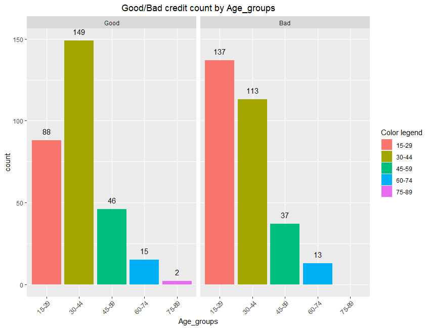
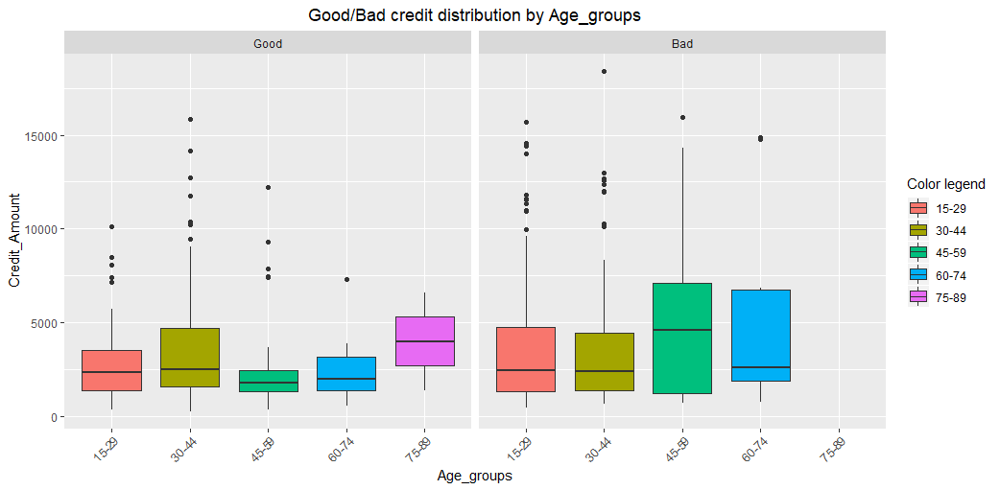

# Credit Risk Analysis (mini project) v2.0

Mini project proposed by the [Data Science Academy](https://www.datascienceacademy.com.br/), regarding credit analysis using R language.

How to predict a good or bad credit concession based on client's profile?
This is a classification task. More information about classification models can be found here: https://towardsdatascience.com/machine-learning-classifiers-a5cc4e1b0623

1. <b>Context:</b> The approach to this question should consider that it will be presented to the bank decision makers.
We want them to know which entities have the highest correlation to the variable we want to predict. We need to create a generalized model with which they can predict a good or bad credit concession based on historical client's profile

2. <b>Entities:</b> Attributes (variables) that could help to predict good or bad credit concession, such as Job, Housing, Age, Sex, Savings Account, Purpose, Duration, etc.
The features of each attribute (or variable) are its kind/type/characteristic, example, Sex: male or female

3. <b>Data:</b> Will be used the German credit dataset*, with an addition of a 21th** column (attribute/variable) that represents the historical definition for each concession (row).

\* Original dataset: https://archive.ics.uci.edu/ml/datasets/Statlog+%28German+Credit+Data%29

\** Dataset with addition: https://github.com/marcusdipaula/dsa-credit-analysis/blob/master/credit.csv

### Summary

1. [Target variable distribution before balancing](#1-target-variable-distribution-before-balancing)
2. [Good or Bad credit count (BarPlots) by some categorical variables](#2-good-or-bad-credit-count-by-some-categorical-variables-after-balancing)
3. [Good or Bad credit distribution (BoxPlots) by some categorical variables](#3-good-or-bad-credit-distribution-by-some-categorical-variables)
4. [Predictors ranking](#4-predictors-ranking)
5. [Variables correlations](#5-variables-correlations)
6. [AUC of ROC of the 3 models](#6-auc-of-roc-of-the-3-models)
7. [Confusion Matrix of the 3 models](#7-confusion-matrix-of-the-3-models)

## Here are some results of this short analysis:

### 1. Target variable distribution before balancing

### 2. Good or Bad credit count by some categorical variables after balancing

### 3. Good or Bad credit distribution by some categorical variables

## Some analysis on feature selection, correlations and ROC curve of a first and second models

### 4. Predictors ranking

### 5. Variables correlations

### 6. AUC of ROC of the 3 models

####Random Forest algorithm

####Generalized Linear Model with Stepwise Feature Selection algorithm

####AdaBoost Classification Trees algorithm

### 7. Confusion Matrix of the 3 models

####Random Forest algorithm

####Generalized Linear Model with Stepwise Feature Selection algorithm

####AdaBoost Classification Trees algorithm

