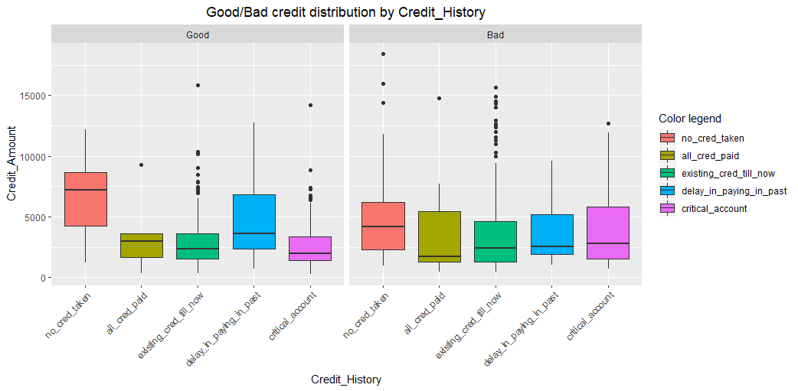

# Credit Risk Analysis (mini project) v1.0

Mini project proposed by the [Data Science Academy](https://www.datascienceacademy.com.br/), regarding credit analysis using R language.

How to predict a good or bad credit concession based on client's profile?
This is a classification task. More information about it can be found here: https://towardsdatascience.com/machine-learning-classifiers-a5cc4e1b0623

1. <b>Context:</b> The approach to this question should consider that it will be presented to the bank decision makers.
We want them to know which entities have the highest correlation to the variable we want to predict. We need to create a generalized model with which they can predict a good or bad credit concession based on historical client's profile

2. <b>Entities:</b> Attributes (variables) that could help to predict good or bad credit concession, such as Job, Housing, Age, Sex, Savings Account, Purpose, Duration, etc.
The features of each attribute (or variable) are its kind/type/characteristic, example, Sex: male or female

3. <b>Data:</b> Will be used the German credit dataset*, with an addition of a 21th** column (attribute/variable) that represents the historical definition for each concession (row).

\* Original dataset: https://archive.ics.uci.edu/ml/datasets/Statlog+%28German+Credit+Data%29

\** Dataset with addition: https://github.com/marcusdipaula/dsa-credit-analysis/blob/master/credit.csv

## Here are some results of this short analysis:

### Target variable distribution

### Good or Bad credit count by some categorical variables

### Good or Bad credit distribution by some categorical variables

## Some analysis on feature selection, correlations and ROC curve of a first and second models

### Confusion Matrix of a first model

### Confusion Matrix of a second model (with Cost Function: 0, 1.5, 0.5, 0)

