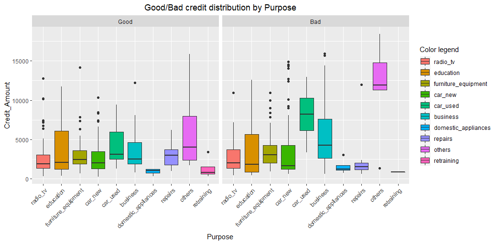
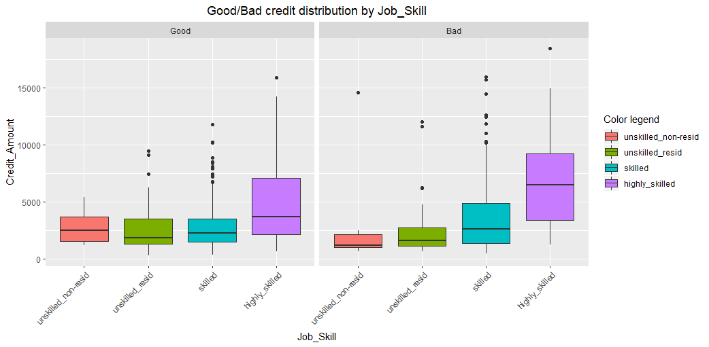

# Credit Risk Analysis (mini project) v2.0

Mini project proposed by the [Data Science Academy](https://www.datascienceacademy.com.br/), regarding credit analysis using R language.

How to predict a good or bad credit concession based on client's profile?
This is a classification task. More information about classification models can be found here: https://towardsdatascience.com/machine-learning-classifiers-a5cc4e1b0623

1. <b>Context:</b> The approach to this question should consider that it will be presented to the bank decision makers.
We want them to know which entities have the highest correlation to the variable we want to predict. We need to create a generalized model with which they can predict a good or bad credit concession based on historical client's profile

2. <b>Entities:</b> Attributes (variables) that could help to predict good or bad credit concession, such as Job, Housing, Age, Sex, Savings Account, Purpose, Duration, etc.
The features of each attribute (or variable) are its kind/type/characteristic, example, Sex: male or female

3. <b>Data:</b> Will be used the German credit dataset*, with an addition of a 21th** column (attribute/variable) that represents the historical definition for each concession (row).

\* Original dataset: https://archive.ics.uci.edu/ml/datasets/Statlog+%28German+Credit+Data%29

\** Dataset with addition: https://github.com/marcusdipaula/dsa-credit-analysis/blob/master/credit.csv

### Summary

1. [Personal framework for a systematic approach](#1-personal-framework-for-a-systematic-approach)
2. [Target variable distribution before balancing](#2-target-variable-distribution-before-balancing)
3. [Good or Bad credit count (BarPlots) by some categorical variables](#3-good-or-bad-credit-count-by-some-categorical-variables-after-balancing)
4. [Good or Bad credit distribution (BoxPlots) by some categorical variables](#4-good-or-bad-credit-distribution-by-some-categorical-variables)
5. [Predictors ranking](#5-predictors-ranking)
6. [Variables correlations](#6-variables-correlations)
7. [AUC of ROC of the 3 models](#7-auc-of-roc-of-the-3-models)
8. [Confusion Matrix of the 3 models](#8-confusion-matrix-of-the-3-models)
9. [AUROC comparison](#9-auroc-comparison)

### 1. Personal framework for a systematic approach

#### FUNDAMENTALS

1. Problem statement and comprehension of the context
    - What am I trying to solve?
    - Who will benefit of/is asking for this solution?
    - What would be the ideal scenario for them?
    - How could I use the available data to help them achieve this scenario?
    - Why solve this problem? (purpose)

2. Looking for data:
    - Identify entities (and its attributes) of the problem
    - Collect data that represents entities
    - Which hypotheses could I suppose?
    - Explore the data (superficially) to understand it
    - Could I use an algorithm to address the issue or solve it? Which one?

#### DATA WRANGLING

3. Data preparation and Exploration (Feature Engineering orientated to the 4th and 5th phase)
    - Is my dataset tidy?
    - Is my dataset clean?
    - Which correlations exists between all variables and to the target?
    - There is any NA in my dataset? If so, how should I treat them? Which effects would it have?
    - Should I narrowing in on observations of interest? Which effects would it have?
    - Should I reduce my variables? Which effects would it have?
    - Should I create new variables that are functions of existing ones? Which effects would it have?
    - Should I binning variables? Which effects would it have?
    - should I convert variables (categorical = numerical / vv)? Which effects would it have?
    - Should I dummy coding categorical variables? Which effects would it have?
    - Should I standardize numerical variables? Which effects would it have?
    - Can I test my hypotheses?

4. Building and validating models (orientated to the 5th phase)
    - Train and test a ML model
    - Which performance metrics should I rely on?
    - Iteration

#### DEPLOYING

5. Deploy
    - Data StoryTelling
    - How can I deploy the model to production?
    - Which strategies should I consider?
    - [An overview of what should be considered](https://christophergs.github.io/machine%20learning/2019/03/17/how-to-deploy-machine-learning-models/)

### 2. Target variable distribution before balancing

### 3. Good or Bad credit count by some categorical variables after balancing

### 4. Good or Bad credit distribution by some categorical variables

## Some analysis on feature selection, correlations and ROC curve of a first and second models

### 5. Predictors ranking

### 6. Variables correlations

### 7. AUC of ROC of the 3 models

#### Random Forest algorithm

#### Generalized Linear Model with Stepwise Feature Selection algorithm

#### AdaBoost Classification Trees algorithm

### 8. Confusion Matrix of the 3 models

#### Random Forest algorithm

#### Generalized Linear Model with Stepwise Feature Selection algorithm

#### AdaBoost Classification Trees algorithm

### 9. AUROC comparison

